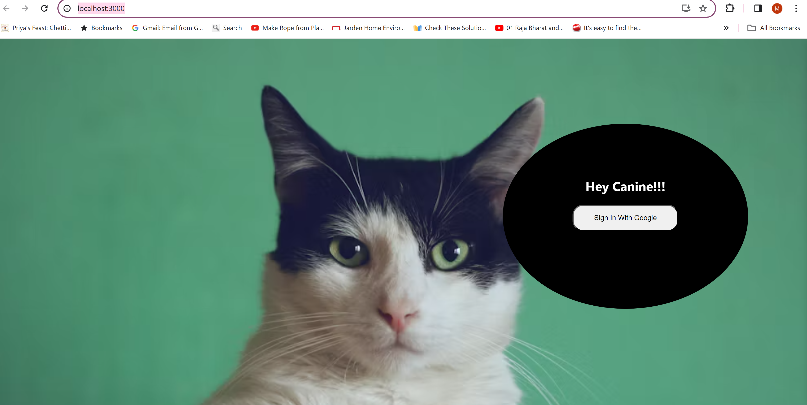
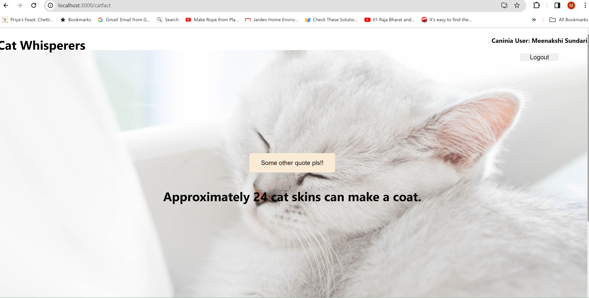

# UPTURN BRANDS CAT FACT

### Table of Contents

1. [About the Project](#about-the-project)
    - [Built With](#built-with)
2. [Getting Started](#getting-started)
    - [Pre-requisites](#pre-requisites)
    - [Installation](#installation)
3. [Build Status](#build-status)
4. [Screenshots](#screenshots)
5. [Features](#features)
6. [Reference](#reference)

## About the Project

The main purpose of this project is to display a fact about cat after the user is authenticated using google token. The fact will be refreshed with a different fact on click of a button.

### Built With

This project is built with
1. HTML
2. CSS
3. REACT JS
4. JAVA SCRIPT
5. Express JS
7. Node JS

## Getting Started

This project was created with [Create React App](https://github.com/facebook/create-react-app).

### Pre-requisites

Install the react library

* npm install npm@latest -g

Create the react app

* npx create-react-app app-name

### Installation

1. [Clone the repo](https://github.com/meenakshisureshbabu/upturnbrands)

* #### git clone git-hub-repo url

2. Install npm packages

* #### npm install

3. Run the below command in the project directory

* #### `npm run build`

4. Add the API (Server-http://localhost:8080) url in .env file

5. Add the google client ID and google secret key, Client URL as "http://localhost/3000 in .env file in the server folder

6. In the client project directory, you can run:

* #### `npm start`

7. In the project directory install the following:

* #### `npm install passport`
* #### `npm install passport-oauth20`
* #### `npm install react-router-dom`
* #### `npm install cors`
* #### `npm install express`
* #### `npm install dotenv`

8. Run the server in the port 8080 in the server folder

* #### `nodemon server`

Runs the app in the development mode.\
Open [http://localhost:3000](http://localhost:3000) to view it in your browser.

The page will reload when you make changes.
You may also see any lint errors in the console.

You can learn more in the [Create React App documentation](https://facebook.github.io/create-react-app/docs/getting-started).

To learn React, check out the [React documentation](https://reactjs.org/).

### Build Status

The cat fact response from the API will be stored in the in-memory array.

### Screenshots

The user can give email id along with the password. Once the credentials are valid, the use is logged in.

### Features

This website has a feature of user authorization using google passport.

### Reference

1. [w3Schools](https://www.w3schools.com/)
2. [Unsplash](https://unsplash.com/)

